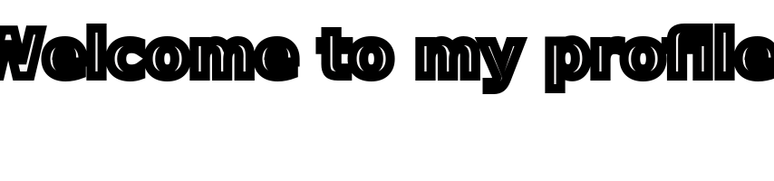

<h1 align="center">👋 Hi there, I'm PacificD</h1>

<h3 align="center">🔭 A passionate developer from India</h3>
<h3 align='center'>😄 Pronouns: PacificD he/him</h3>
<h3 align='center'>⚡ Fun fact: standard INFP :)</h3>

<h4 align='center'> 👨‍💻 All of my projects are available at https://github.com </h4>

<picture>
  <source
    srcset="https://github-readme-stats.vercel.app/api/top-langs?username=pacificd&show_icons=true&locale=en&layout=compact&theme=dark"
    media="(prefers-color-scheme: dark)"
  />
  <source
    srcset="https://github-readme-stats.vercel.app/api/top-langs?username=pacificd&show_icons=true&locale=en&layout=compact"
    media="(prefers-color-scheme: light), (prefers-color-scheme: no-preference)"
  />

  
</picture>

<picture>
  <source
    srcset="https://github-readme-stats.vercel.app/api?username=PacificD&show_icons=true&theme=dark"
    media="(prefers-color-scheme: dark)"
  />
  <source
    srcset="https://github-readme-stats.vercel.app/api?username=PacificD&show_icons=true"
    media="(prefers-color-scheme: light), (prefers-color-scheme: no-preference)"
  />

  
</picture>

<h5 align="center">Web Developer</h5>

  
  
  
  
  
  
  
  
  
  

<h5 align='center'>Backend Developer</h5>

  
  
  
  

<h5 align='center'>Tools</h5>

  
  
  
  
  
  
  

